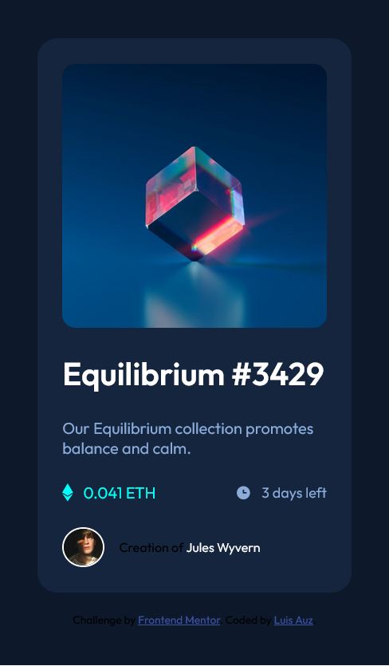

# Frontend Mentor - NFT preview card component solution

This is a solution to the [NFT preview card component challenge on Frontend Mentor](https://www.frontendmentor.io/challenges/nft-preview-card-component-SbdUL_w0U). Frontend Mentor challenges help you improve your coding skills by building realistic projects. 

## Table of contents

- [Frontend Mentor - NFT preview card component solution](#frontend-mentor---nft-preview-card-component-solution)
  - [Table of contents](#table-of-contents)
  - [Overview](#overview)
    - [The challenge](#the-challenge)
    - [Screenshot](#screenshot)
    - [Links](#links)
  - [My process](#my-process)
    - [Built with](#built-with)
    - [What I learned](#what-i-learned)
      - [Overlap Elements](#overlap-elements)
      - [Border-Box](#border-box)
    - [Continued development](#continued-development)
    - [Useful resources](#useful-resources)
  - [Author](#author)
  - [Acknowledgments](#acknowledgments)


## Overview

### The challenge

Users should be able to:

- View the optimal layout depending on their device's screen size
- See hover states for interactive elements

### Screenshot



### Links

- Solution URL: [Add solution URL here](https://github.com/PaxAuz15/frontendmentor_challenges/tree/main/nft_preview_card_component_main)
- Live Site URL: [Add live site URL here](https://your-live-site-url.com)

## My process

### Built with

- Semantic HTML5 markup
- CSS custom properties
- Flexbox
- CSS Grid
- Mobile-first workflow

**Note: I didn't use any libraries or frameworks to resolve this challenge.**

### What I learned

#### Overlap Elements
```html
<div class="card-image">
  
  <div class="icon-view-container">
    
  </div>
</div>
```
```css
.card-image {
    width: 100%;
    display: grid;
    grid-template-columns: 1fr;
    grid-template-rows: 1fr;
    grid-template-areas: "image";
    align-items: center;
    justify-items: center;
}

.image-card, .icon-view-container {
    grid-area: image;
    width: 100%;
    border-radius: 5%;
    max-width: 350px;
}
```

####  Border-Box

```css
* {
    box-sizing: border-box;
    margin: 0;
    padding: 0;
}
```

### Continued development

This is not a finished work. There are issues in the code that I need to improve:
- [Control font size](https://www.youtube.com/watch?v=wARbgs5Fmuw&t=1s) - The font size in the elements that are adapting to the various screens that will represent it.
- [Ways to make a website responsive](https://www.youtube.com/watch?v=VQraviuwbzU) - Recognize the correct patterns and ways, depending on the use case, tools that allow the creation of a responsive website.

### Useful resources

- [Mobile First - CSS](https://www.youtube.com/watch?v=0ohtVzCSHqs&t=10s) - This helped me to recognize the pattern I should follow when developing responsive websites.
- [Overlap Elements](https://www.youtube.com/watch?v=-_ENJ2tRNso) - This is a video which helped me finally understand How to place one element on top of another using CSS Grid rather than resorting to position absolute. 

## Author

<!-- - Website - [Add your name here](https://www.your-site.com) -->
- Frontend Mentor - [@PaxAuz15](https://www.frontendmentor.io/profile/PaxAuz15)
- Twitter - [@luis_auz](https://twitter.com/luis_auz)
- Instagram - [@luis_auz](https://www.instagram.com/luis_auz/)
- Freecodecamp - [@paxauz15](https://www.freecodecamp.org/paxauz15)
- GitHub Profile - [@PaxAuz15](https://github.com/PaxAuz15)

## Acknowledgments

I have learned a lot about web development. Special thanks to [FreeCodeCamp](https://www.freecodecamp.org/) for the knowledge provided. For this specific project, I recommend and thank all the content I found in [Kevin Powell's Youtube channel](https://www.youtube.com/kepowob): A web development genius.
